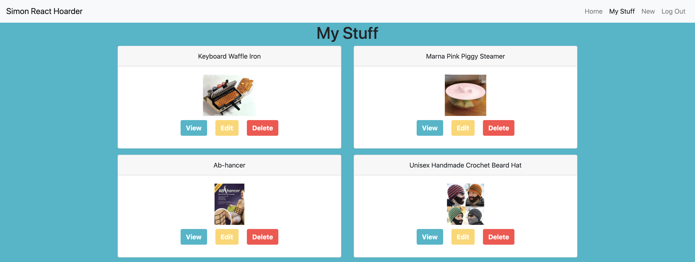
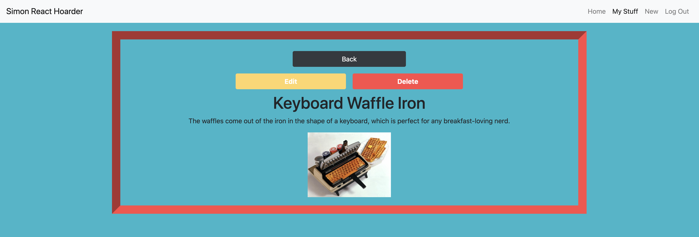

# React Hoarder

## Description
This project gave us the opportunity to practice routing with React Router while continuing to perform CRUD actions on data stored in a Firebase database. 

Project instructions can be foudn here: https://github.com/nss-nightclass-projects/react-hoarder.

## Screenshots
##### My Stuff Page

##### Single Item View

## Features
1. Users can log in with Google authentication. 
1. When logged in, users can see only their items. 
1. The app uses different urls to let users know what page they are on. 
1. Users can perform CRUD actions on items. 
1. Users get an alert before deleting an item to confirm they want to delete it. 

## Technologies
Axios, Bootstrap, CSS, ES6 Modules, Firebase (for authentication and data management), Github (for version control and project management), Google login authentication, HTML5, JavaScript, JQuery, JSX, React, SASS, SweetAlert2, Webpack

## How to Run
1. Clone down this repo.
1. Make sure you have http-server installed via npm. If not, get it [here](https://www.npmjs.com/package/http-server).
1. On your command line, run `hs -p 9999`.
1. In your browser, navigate to `http://localhost:9999`.
